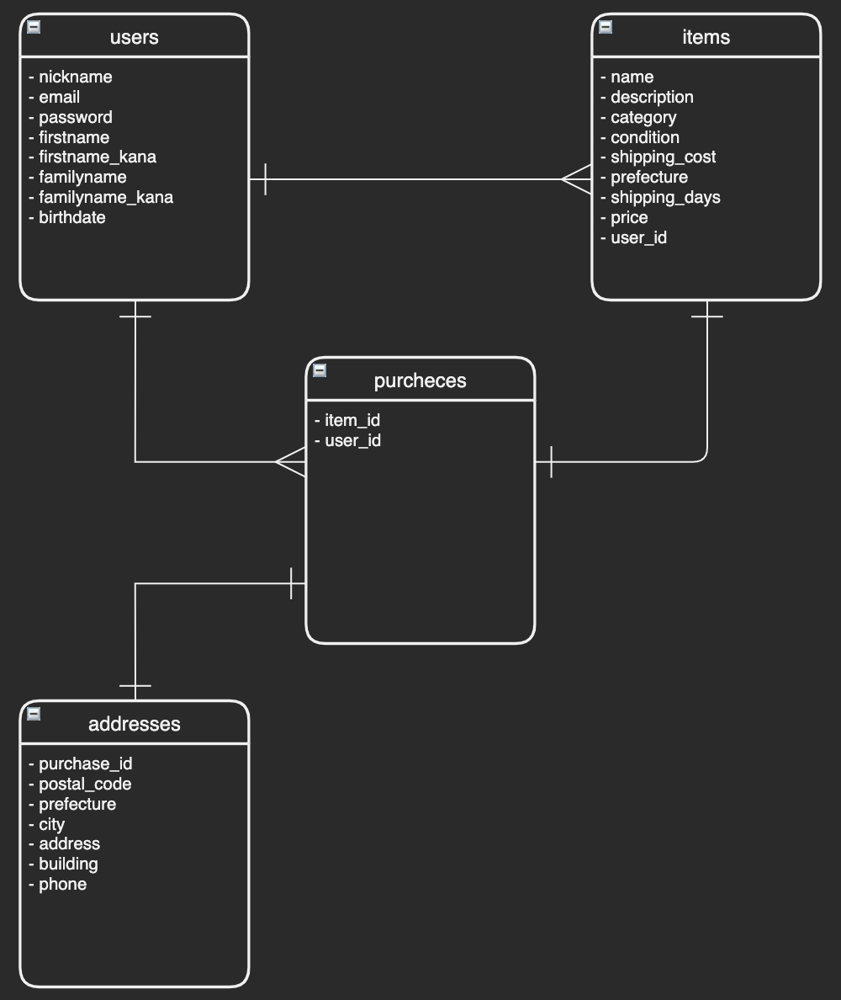

# README

## ER線図

## DB設計

## usersテーブル
| column              | type        | options                   |
| ------------------- | ----------- | ------------------------- |
| nickname            | string      | null: false               |
| email               | string      | null: false, unique: true |
| encrypted_password  | string      | null: false               |
| firstname           | string      | null: false               |
| familyname          | string      | null: false               |
| firstname_kana      | string      | null: false               |
| familyname_kana     | string      | null: false               |
| birth_date          | date        | null: false               |

### Associations
- has_many :items, dependent: :destroy
- has_many :purchases, dependent: :destroy

## itemsテーブル
| column            | type        | options                         |
| ----------------- | ----------- | ------------------------------- |
| name              | string      | null: false                     |
| description       | text        | null: false                     |
| category_id       | integer     | null: false                     |
| condition_id      | integer     | null: false                     |
| shipping_cost_id  | integer     | null: false                     |
| prefecture_id     | integer     | null: false                     |
| shipping_days_id  | integer     | null: false                     |
| price             | integer     | null: false                     |
| user              | references  | null: false, foreign_key: true  |

### Associations
- belongs_to :user
- has_one :purchase, dependent:  :destroy

## purchasesテーブル
| column        | type        | options                         |
| ------------- | ----------- | ------------------------------- |
| item          | references  | null: false, foreign_key: true  |
| user          | references  | null: false, foreign_key: true  |

### Associations
- belongs_to :item
- belongs_to :user
- has_one :address, dependent:  :destroy

## addressesテーブル
| column        | type        | options                         |
| ------------- | ----------- | ------------------------------- |
| purchase      | references  | null: false, foreign_key: true  |
| postal_code   | string      | null: false                     |
| prefecture_id | integer     | null: false                     |
| city          | string      | null: false                     |
| address       | string      | null: false                     |
| building      | string      |                                 |
| phone         | string      | null: false                     |

### Associations
- belongs_to :purchase
