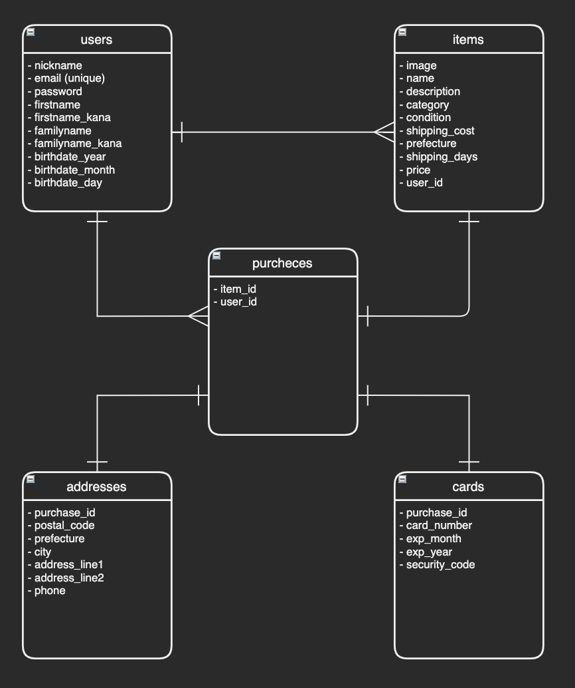

# README

## ER線図

## DB設計

## usersテーブル
| column          | type        | options               |
| --------------- | ----------- | --------------------- |
| nickname        | string      | NOT NULL, UNIQUE      |
| email           | string      | NOT NULL, UNIQUE      |
| password        | string      | NOT NULL              |
| firstname       | string      | NOT NULL              |
| familyname      | string      | NOT NULL              |
| firstname_kana  | string      | NOT NULL              |
| familyname_kana | string      | NOT NULL              |
| birthdate_year  | integer     | NOT NULL              |
| birthdate_month | integer     | NOT NULL              |
| birthdate_day   | integer     | NOT NULL              |

### Associations
- has_many :items, dependent: :destroy
- has_many :purchases, dependent: :destroy

## itemsテーブル
| column          | type        | options               |
| --------------- | ----------- | --------------------- |
| image           | text        | NOT NULL              |
| name            | string      | NOT NULL              |
| description     | text        | NOT NULL              |
| category        | integer     | NOT NULL              |
| condition       | integer     | NOT NULL              |
| shipping_cost   | integer     | NOT NULL              |
| prefecture      | integer     | NOT NULL              |
| shipping_days   | integer     | NOT NULL              |
| price           | integer     | NOT NULL              |
| user_id         | references  | NOT NULL, FOREIGN KEY |

### Associations
- belongs_to :user
- has_one :purchase, dependent:  :destroy

## purchasesテーブル
| column          | type        | options               |
| --------------- | ----------- | --------------------- |
| item_id         | references  | NOT NULL, FOREIGN KEY |
| user_id         | references  | NOT NULL, FOREIGN KEY |

### Associations
- belongs_to :purchase
- belongs_to :user
- has_one :card, dependent:  :destroy
- has_one :address, dependent:  :destroy

## cardsテーブル
| column          | type        | options               |
| ----------------| ----------- | --------------------- |
| purchase_id     | references  | NOT NULL, FOREIGN KEY |
| card_number     | integer     | NOT NULL              |
| exp_month       | integer     | NOT NULL              |
| exp_year        | integer     | NOT NULL              |
| security_code   | integer     | NOT NULL              |

### Associations
- belongs_to :purchase

## addressesテーブル
| column          | type        | options               |
| --------------- | ----------- | --------------------- |
| purchase_id     | references  | NOT NULL, FOREIGN KEY |
| postal_code     | integer     | NOT NULL              |
| prefecture      | integer     | NOT NULL              |
| city            | string      | NOT NULL              |
| address_line1   | string      | NOT NULL              |
| address line2   | string      |                       |
| phone           | integer     | NOT NULL              |

### Associations
- belongs_to :purchase
